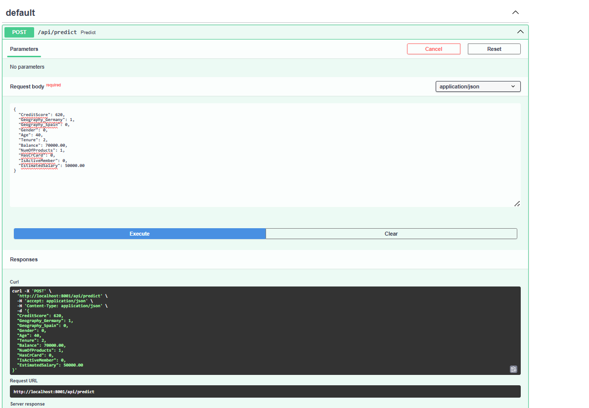

# Customer Churn Prediction API (FastAPI)
This project provides an API for predicting customer churn based on user input using a trained XGBoost classifier.
## Table of Contents
 - [Description](#description)
 - [Requirements](#requirements)
 - [Getting Started](#getting-started)
   - [1. Train and Save the Model](#1-train-and-save-the-model)
   - [2. Deploy FastAPI](#2-deploy-fastapi)
   - [3. Run Streamlit](#3-streamlit)
 - [Usage](#usage)
 - [Endpoints](#engpoints)
 - [Example Input and Output](#example-input-and-output)
 - [File Structure](#file-structure)
 - [License](#license)

## Description
The FastAPI application loads a trained XGBoost classifier model and exposes an endpoint for predicting whether a customer is likely to churn based on the following features:
- CreditScore
- Geography
- Gender
- Age
- Tenure
- Balance
- NumOfProducts
- HasCrCard
- IsActiveMember
- EstimatedSalary

The API returns a prediction indicating whether the customer will exit (1) or stay (0).

## Requirements
To set up and run this project, you will need the following python packages:

- 'fastapi'
- 'uvicorn'
- 'scikit-learn'
- 'pandas'
- 'joblib'
- 'numpy'
- 'streamlit'
- 'xgboost'

You can install these dependencies by running:

```bash
pip install -r requirements.text
```

## Getting Started
Follow these steps to set up and run the project.

1. Train and Save Model

Train the XGBoost classifier model using Scikit-Learn and save the trained model for deployment:
   ```bash
   python model_build.py
   ```
   This will create the `model.pkl` file in the `model/` directory.
2. Deploy FastAPI
The FastAPI application (`api.py`) loads the saved model and provides an endpoint for predictions. Run it using uvicorn:
uvicorn api:app --reload

This will start the FastAPI server at `http://127.0.0.1:8000`

## Endpoints


- POST /api/predict
- Description: Accepts customer feature values and returns a predicted churn outcome (0 or 1).
- Input JSON:
```commandline
{
  "CreditScore": 750,
  "Geography": "France",
  "Gender": "Male",
  "Age": 35,
  "Tenure": 5,
  "Balance": 125000.00,
  "NumOfProducts": 2,
  "HasCrCard": 1,
  "IsActiveMember": 1,
  "EstimatedSalary": 60000.00
}
```
- Output JSON:
```commandline
{ "churn_prediction": 0 }
```

## Example Input and Output
Example Input:

CreditScore: 620
Geography: Germany
Gender: Female
Age: 40
Tenure: 2
Balance: 70000.00
NumOfProducts: 1
HasCrCard: 0
IsActiveMember: 0
EstimatedSalary: 50000.00

Example Output:

Predicted Churn: 1 (Customer is likely to churn)

## File Structure

```commandline
📦 XGBoostClassifier API
├─ data
│  └─ data.csv
├─ model
│  └─ model.pkl
├─ src
├─ .gitignore
├─ api.py
├─ model_build.py
├─ README.md
└─ requirements.txt
```

## License
This project is licensed under [

